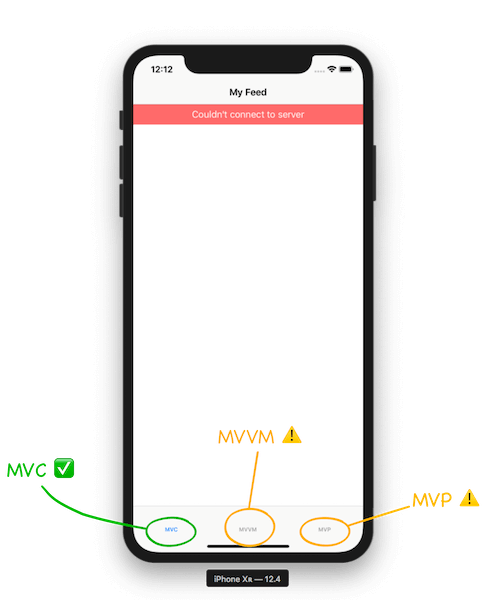

# The UI Design Patterns Challenge - iOSLeadEssentials.com

It’s time to put your UI design patterns skills to the test! 

You are called to implement a new UI feature: displaying localized error messages to the customers when the feed load fails.

The goal is to implement this feature in both **MVVM** and **MVP**.

We’ve provided you with an MVC implementation using a reusable `ErrorView` as the `UITableView.tableHeaderView`. 

You can study and use the MVC solution as a guideline to help you implement the MVVM and MVP versions. But feel free to go the extra mile and implement it with your our custom views.

## Goals

1. Display an error message to the customer when the feed load fails.
2. The error message must be localized in **at least** 4 languages. 
	- The challenge project comes with three supported languages: English, Portuguese, and Greek. 
	- The MVC solution contains the error message translated in the given supported languages. You can reuse those messages in your MVVM and MVP solutions, but you need to **add at least one extra language** of your choice (tip: use Google Translate if needed).
3. Author the appropriate tests to validate your implementation (aim to write the test first!).
4. Extra functionality (optional): Dismiss the error message on tap.

## Instructions

- Fork the latest version of [the challenge repo](https://github.com/essentialdevelopercom/ios-lead-essentials-ui-design-patterns-challenge).
- Open the `UIDesignPatternsChallenge.xcodeproj` project.
- The project is separated into modules:
	- The `Feed Feature Module` is the shared module containing the `FeedItem` data model and abstract interfaces. ***You won’t need to change anything in this module.***
	- The `Feed iOS App` is the Main iOS Application module for composing the MV\* solutions in a `UITabBarController` and running the iOS application. ***You won’t need to change anything in this module.***
	- The `MVC Module` contains the finished MVC solution—use it as a guideline.
	- The `MVVM Module` contains the unfinished MVVM solution. You must implement the localized error message.
	- The `MVP Module` contains the unfinished MVP solution. You must implement the localized error message.
- Every module has its own scheme for building and running tests. 
	- When studying the MVC solution, switch to the MVC scheme. 
	- When developing the MVVM solution, switch to the MVVM scheme. 
	- When developing the MVP solution, switch to the MVP scheme.
	- When running the application, switch to the `Feed iOS App` scheme.
- While developing your solutions, run all tests in the selected scheme with CMD+U.
- The MV\* modules are independent of each other. For example, a change in the MVC `FeedViewController` will not affect the MVVM `FeedViewController` (even though they have the same name, they belong to distinct module namespaces!).
- Your changes in the MV\* modules will reflect in the respective MV\* tab of the `Feed iOS App` Application.
	- If you’re interested in studying the composition of the MV\* modules, have a look at the `AppDelegate` in the `Feed iOS App` module.
- You can see/interact with your solution by running the Application on the simulator (or device). 
	- Switch to the `Feed iOS App` scheme and press CMD+R.
	- Navigate to the MV\* tab on the simulator/device.
	- *The feed reload will always fail after a given timeout, so you can test your solution.* If you’re interested in studying how the feed reload always fails, have a look at the `AlwaysFailingLoader` (and its tests!) in the `Feed iOS App` module.
- When you’re done implementing your solutions, create a Pull Request from your branch to the main challenge repo. 
Before creating a Pull Request, make sure all the tests are passing by switching to the `CI` scheme and running the tests on your machine (CMD+U).

## Guidelines

- Aim to test-first and commit your changes every time you add/alter the behavior of your system or refactor your code.
- The system should always be in a green state, meaning that in each commit, all tests should be passing.
- The project should build without warnings.
- The code should be carefully organized and easy to read (e.g., indentation must be consistent, etc.).
- Aim to create short methods respecting the Single Responsibility Principle.
- Aim to declare dependencies explicitly, instead of implicitly, leveraging dependency injection wherever necessary.
- Aim for descriptive commit messages that clarify the intent of your contribution, which will help other developers understand your train of thought and purpose of changes.
- Make careful and proper use of access control, marking as private any implementation details that aren’t referenced from other external components.
- Aim to write self-documenting code by providing context and detail when naming your components, avoiding explanations in comments.

Happy coding!
